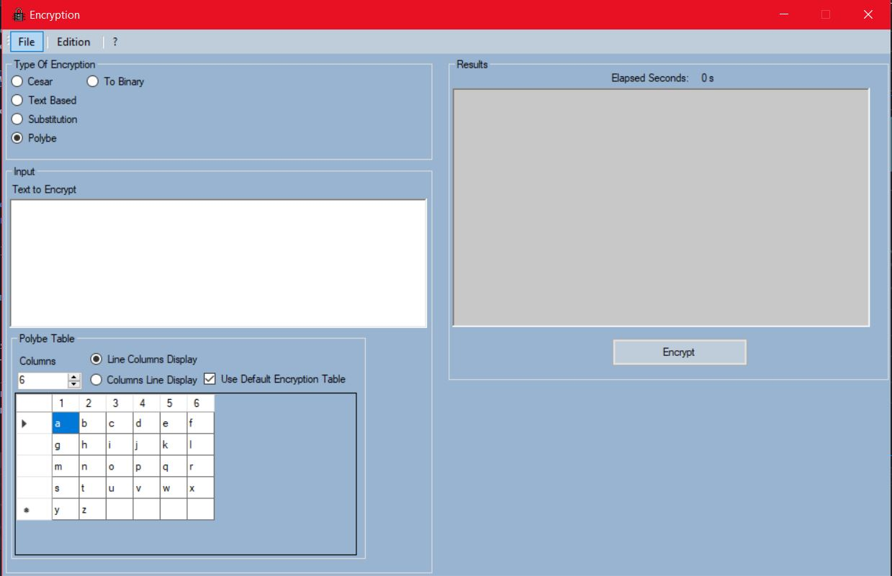
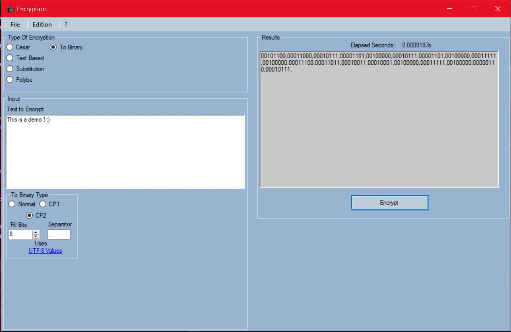

# EncryptionApp
An application that encrypts text using different encryption algorithms. This application was made using winforms & .netframework 4.7.1 and as such only runs on Windows.

This is also my first GUI app ever! 

# Algorithms

- Cesar encryption _(with any offset and only for alphabet)_
- By key _(With any key length and only for alphabet)_
- By substitution _(Alphabet only)_
- Polybe encryption _(With both line-column and column-line and for any character defenied by the user)
- To binary _(Using UTF-8 values of chars and has 3 types normal, CP1 and CP2)_

All results can be saved to a text file.

# Problems and issues
- Everything runs on the same thread (didn't know threads back in the time), with big texts the app freezes for some time.
- Some ugly code
- Most algorithms only take in account alphabet
- Ugly UI

# Screenshots
Screenshot #1       |  Screenshot #2
:-------------------------:|:-------------------------:
 |
 
